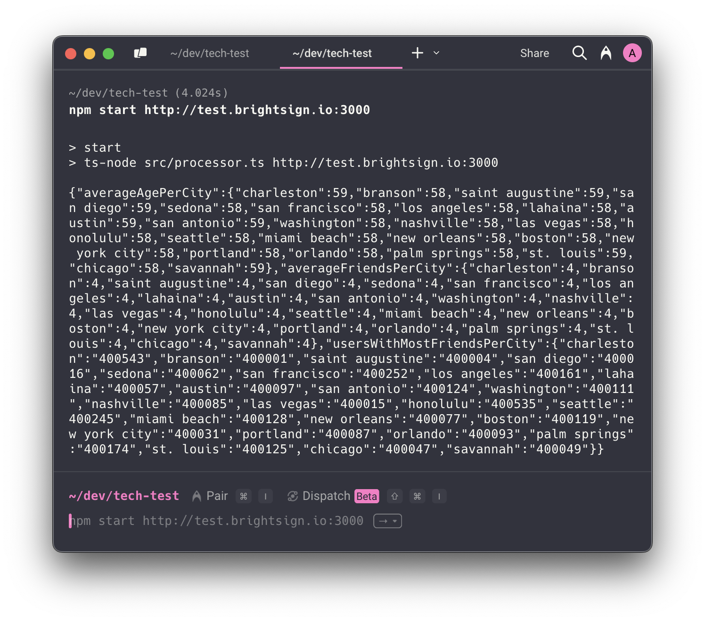

# Take-Home Coding Assignment Solution! 🌟

## Run Instructions ℹ️

### System Requirements 💻

- Node.js version 20+

---

### Script Execution 🏃

From the project root, execute the script with the following command, replacing `{ENDPOINT_URI}` with your actual endpoint:

```bash
npm start {ENDPOINT_URI}
```



Example run:

```json
{
  "averageAgePerCity": {
    "charleston": 59,
    "branson": 58,
    "saint augustine": 59,
    "san diego": 59,
    "sedona": 58,
    "san francisco": 58,
    "los angeles": 58,
...
  },
  "averageFriendsPerCity": {
    "charleston": 4,
    "branson": 4,
    "saint augustine": 4,
    "san diego": 4,
    "sedona": 4,
    "san francisco": 4,
    "los angeles": 4,
    "lahaina": 4,
    "austin": 4,
...
  },
  "usersWithMostFriendsPerCity": {
    "charleston": "400543",
    "branson": "400001",
    "saint augustine": "400004",
    "san diego": "400016",
    "sedona": "400062",
    "san francisco": "400252",
    "los angeles": "400161",
    "lahaina": "400057",
    "austin": "400097",
...
  }
}
```

---

### Mock API

For development and testing, a static mock dataset is used:

```ts
{
  id: 1,
  name: "Ava",
  city: "Saint Augustine",
  age: 32,
  friends: [
    { name: "Emily", hobbies: ["Fishing", "Walking"] },
    { name: "Emily", hobbies: ["Dancing"] },
    { name: "John", hobbies: ["Skiing & Snowboarding", "Running"] },
  ],
},
{
  id: 2,
  name: "Chris",
  city: "St. Louis",
  age: 45,
  friends: [
    { name: "Kevin", hobbies: ["Quilting", "Martial Arts"] },
    { name: "Ava", hobbies: ["Cooking", "Reading"] },
  ],
},
{
  id: 3,
  name: "Olivia",
  city: "Saint Augustine",
  age: 40,
  friends: [
    { name: "Kevin", hobbies: ["Yoga", "Walking"] },
    { name: "Emily", hobbies: ["Skiing & Snowboarding", "Yoga"] },
  ],
},
{
  id: 4,
  name: "Lucas",
  city: "St. Louis",
  age: 60,
  friends: [],
},
```

**Expected results from this dataset:**

1. **Average age of users per city**

   - `saint augustine`: 36
   - `st. louis`: 52.5

2. **Average number of friends per city**
   - `saint augustine`: 2.5
   - `st. louis`: 1

---

You can start this by running `npm run mock-api`

## Demonstrations 🔎

### 1. Average age of all users per city

**Logic:**

- Get all unique city names (lowercased)
- For each city:
  - If no users exist, return `0`
  - Else, sum the ages of all users
  - Divide total by user count

---

### 2. Average number of friends per city

**Logic:**

- Get all unique city names (lowercased)
- For each city:
  - If no users exist, return `0`
  - Else, sum the number of friends for all users
  - Divide total by user count

---

### 3. The user with the most friends per city

**Logic:**

- Get all unique city names (lowercased)
- For each city:
  - Get all users for this city
  - For each user, store their ID and number of friends
  - Sort descending by friend count
  - Return the user ID of the top user

> I chose to return the **user ID** instead of name, as names are not guaranteed to be unique.

---

## Error Handling 👮‍♂️

- The script checks if the endpoint URI is provided as a CLI param. If missing, the process exits with a helpful error message.
- The API returns malformed or irregular JSON (e.g., multiple objects without line breaks). To avoid parse errors:
  - The response is cleaned and split by line
  - Only lines that start with `{` and end with `}` are parsed
  - This may discard some corrupt data, but ensures safe parsing without needing complex string manipulation
- All string comparisons (like city names) are normalized to lowercase
- Divide by zero scenarios (e.g., average on an empty user set) are handled gracefully
- Unhandled exceptions cause the script to exit — in a production app, custom error handling/logging would be required to avoid leaking sensitive info
- No deep runtime validation is performed — if the data is bad, the output will also be inaccurate
